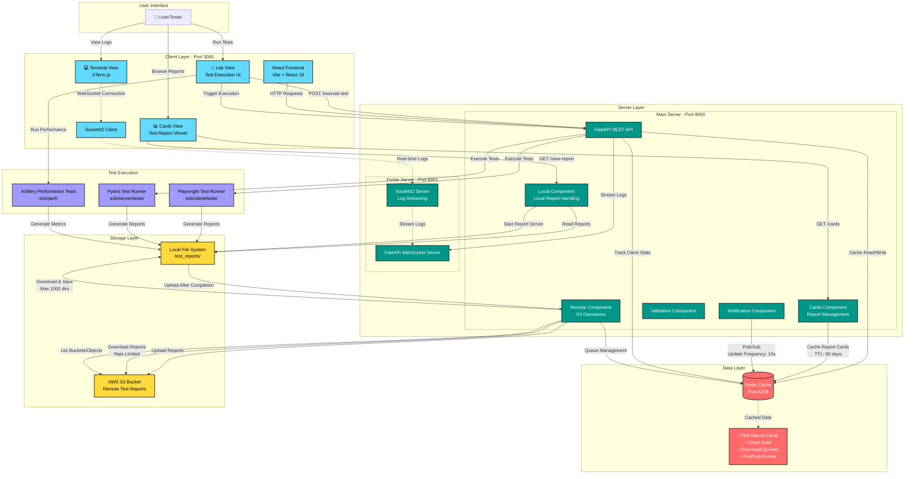
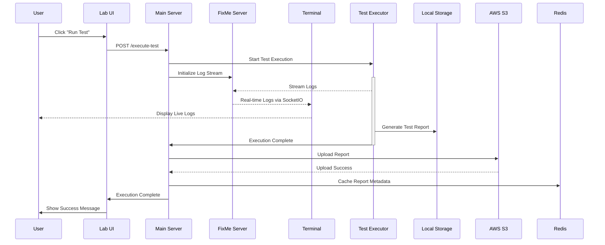
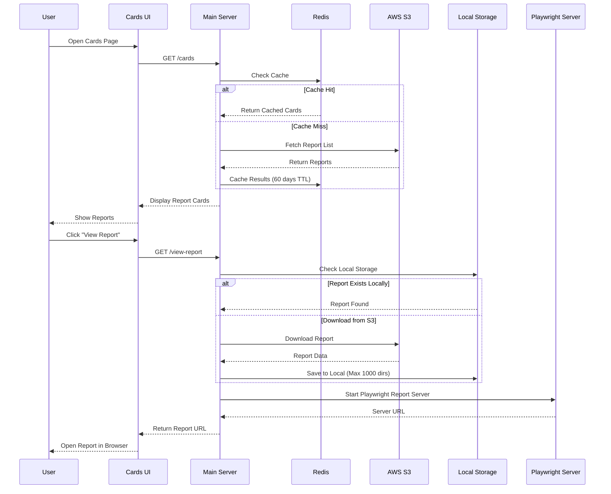
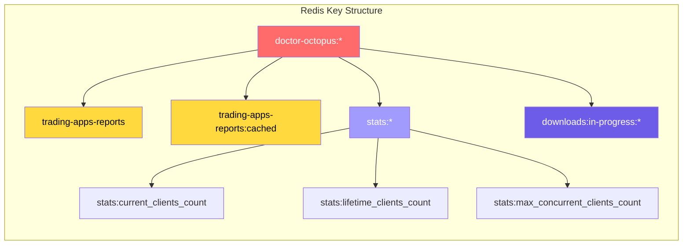
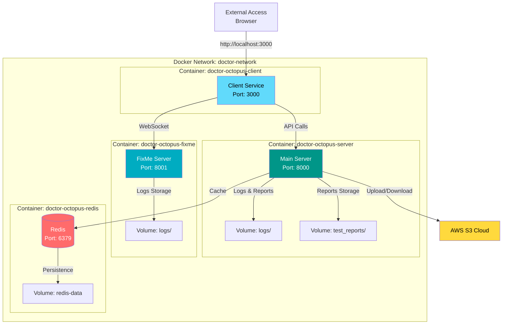
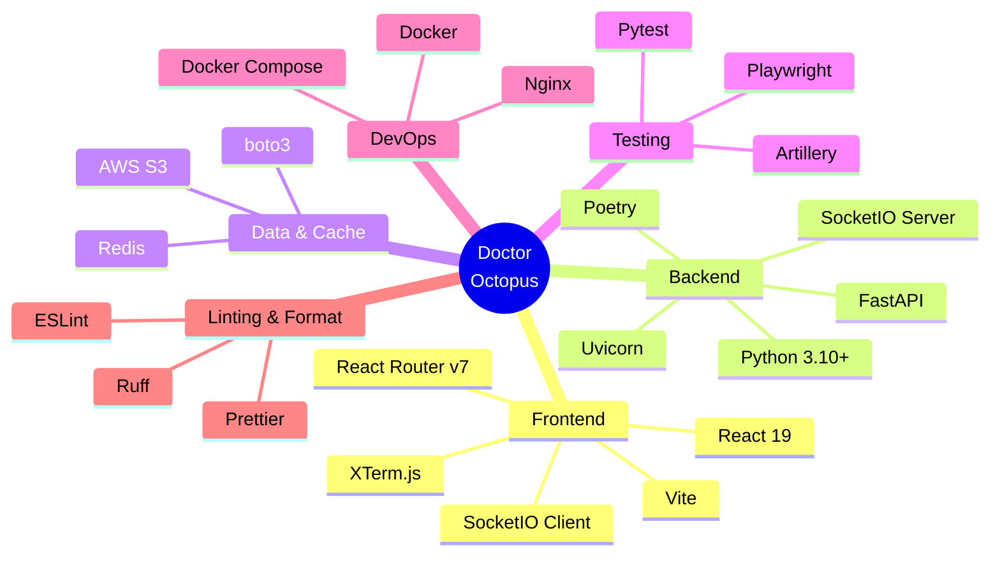

# Doctor Octopus - System Architecture

## High-Level System Design

## Data Flow Diagrams

### 1. Test Execution Flow

### 2. Report Viewing Flow

### 3. Redis Caching Strategy

## Component Interactions

### Service Communication Matrix

| Source         | Target       | Protocol       | Port | Purpose                                         |
| -------------- | ------------ | -------------- | ---- | ----------------------------------------------- |
| Client         | Main Server  | HTTP/REST      | 8000 | API requests, test execution, report management |
| Client         | FixMe Server | WebSocket      | 8001 | Real-time log streaming                         |
| Main Server    | Redis        | Redis Protocol | 6379 | Caching, stats, queues, pub/sub                 |
| Main Server    | AWS S3       | HTTPS          | 443  | Upload/download test reports                    |
| Main Server    | Local FS     | File I/O       | -    | Read/write test reports                         |
| FixMe Server   | Client       | SocketIO       | 8001 | Bidirectional log streaming                     |
| Test Executors | Local FS     | File I/O       | -    | Generate test reports                           |

### Redis Cache Configuration

- **Test Report Cards**: 60-day TTL
- **Download Queue**: 10-minute TTL
- **Cache Reload Queue**: 5-minute TTL
- **Stats Tracking**: No expiration (persistent counters)
- **Pub/Sub Frequency**: 1s for pubsub, 10s for S3 notifications

### S3 Rate Limiting Strategy

- **Folder Batch Size**: 5 folders per batch
- **File Batch Size**: 20 files per batch
- **Wait Time Between Batches**: 0.25 seconds
- **Max Local Directories**: 1000 (cleanup triggered when exceeded)

## Deployment Architecture

### Docker Compose Setup

## Technology Stack

## Performance Characteristics

- **Concurrent Workers**: 20 in production, 1 in development
- **Test Execution**: Playwright workers: 3, retries: 1
- **WebSocket**: Dedicated FixMe server prevents blocking main API
- **Cache TTL**: 60 days for report cards (configurable)
- **Rate Limiting**: S3 operations throttled to prevent rate limits
- **Max Local Storage**: 1000 test report directories before cleanup
