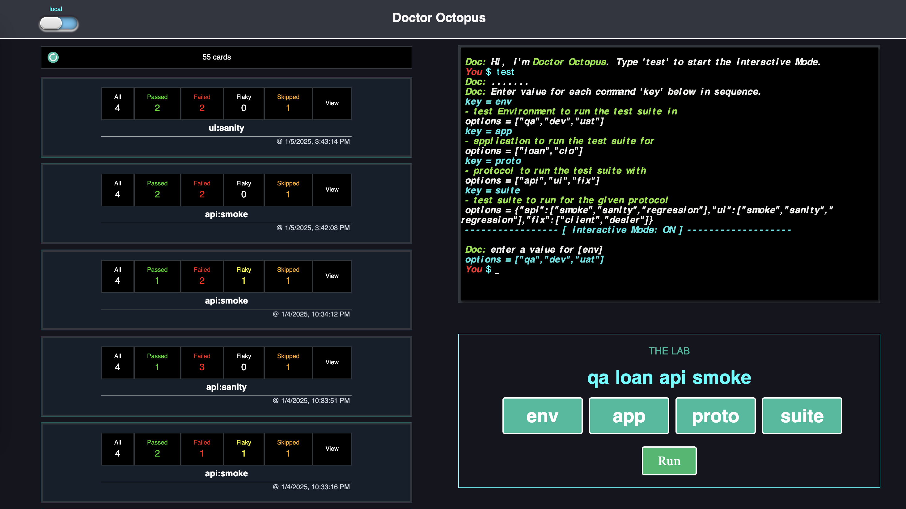

## DOCTOR-OCTOPUS

A multi-component application with a full battery (a server & a client). The app includes **The Lab**: a test runner, **Cards**: a test report viewer and the **Terminal** features that aim to make testing experience a smoother process for your website. The app is built for Playwright library that makes running Playwright test suites and then viewing the test reports a simpler process. You can run a test suite using The Lab, see the live logs streamed in the Terminal and then view the HTML report it generates in the Cards section. Once a test execution is finished the reports and attachements will be uploaded to the provided AWS S3 bucket so that it can be viewed from the remote source later even if it's deleted from your local. When the 'View' button for a report card is clicked, the app will start a local server to view the Playwright's default HTML report with my favorite Trace viewer feature.



## Setup

From the root of the Doctor-Octopus project directory execute the following commands in your terminal

1 - `npm run setup`

2 - THE END

## Start

Run the following command on the terminal to start the app on `http://localhost:3000`

1 - `npm start`

project folder structure

```
doctor-octopus
├─ server
│ ├─ src
│ │ └─ ...
│ ├─ setup.py
│ └─ ...
├─ client
│ ├─ src
│ │ └─ ...
│ ├─ package.json
│ └─ ...
├─ package.json
└─ README.md
```

## Key Tech Stacks

- **FastAPI**: server/back-end using Python
- **React**: client/front-end using JavaScript
- **SocketIO**: communicates between the client & the server to execute test suites on the server and then stream the logs in the integrated xterm terminal
- **AWS S3**: remote repository for the test reports

Developer: **IMRAN SAHIL**
