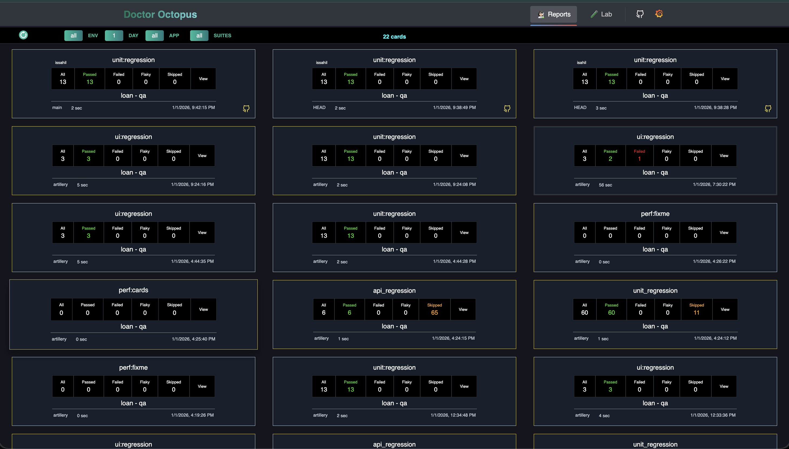
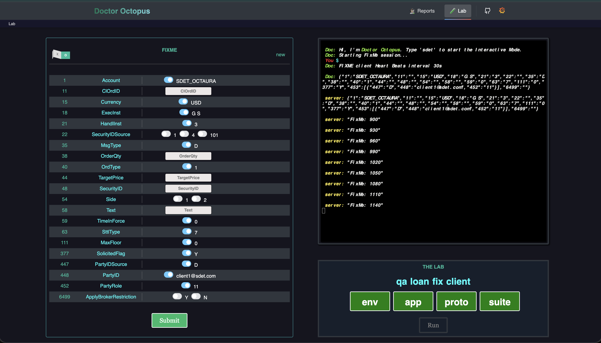

## DOCTOR-OCTOPUS

A multi-component application with a full battery (a server & a client). The app includes **The Lab**: a test runner, **Cards**: a test report viewer and the **Terminal** features that aim to make testing experience a smoother process for your website. The app is built for Playwright library that makes running Playwright test suites and then viewing the test reports a simpler process. You can run a test suite using The Lab, see the live logs streamed in the Terminal and then view the HTML report it generates in the Cards section. Once a test execution is finished the reports and attachements will be uploaded to the provided AWS S3 bucket so that it can be viewed from the remote source later even if it's deleted from your local. When the 'View' button for a report card is clicked, the app will start a local server to view the Playwright's default HTML report with my favorite Trace viewer feature.

### Reports Tab


### Lab Tab


## Setup

From the root of the Doctor-Octopus project directory execute the following commands in your terminal

1 - `npm run setup`

2 - THE END

## Start

Run the following command on the terminal to start the

1 - `npm start`

The app will be available at http://localhost:3000.

project folder structure

```
DOCTOR-OCTOPUS
├─ client [FRONTEND]
│ ├─ src
│ │ └─ ...
│ ├─ package.json
│ │
├─ e2e [TESTS]
│ │
│ ├─ server
│ ├─ client
│ ├─ package.json
│ ├─ pyproject.toml
│ │
├─ server [BACKEND]
│ ├─ src
│ │ └─ ...
│ ├─ pyproject.toml
│ │
├─ package.json
└─ readme.md
```

## Key Tech Stacks

- **FastAPI**: server/back-end REST API using Python.
- **React**: client/front-end using JavaScript.
- **SocketIO**: Streams the logs to the integrated XTerm terminal.
- **AWS S3**: remote repository where the test reports are stored.
- **Redis**: cache db for test report cards.


## Docker: 

### Building & running the Doctor Octopus app in a container

Start the application by running:

1. Using compose
`docker compose up --build`.

2. Using a specific image tag
`docker run -p 3000:3000 -p 8000:8000 --env-file=./.env app:tag`

The app will be available at http://localhost:3000.

### Deploying the app to the cloud

First, build the image, e.g.: `docker build -t app:tag .`.

Then, push it to registry, e.g. `docker push myregistry.com/myapp`.

Consult Docker's [getting started](https://docs.docker.com/go/get-started-sharing/)
docs for more detail on building and pushing.

### References
* [FastAPI Guide](https://fastapi.tiangolo.com/tutorial/first-steps/)
* [ReactJS Guide](https://react.dev/reference/react)
* [Playwright Guide](https://playwright.dev/docs/intro)
* [PyTest Guide](https://docs.pytest.org/en/stable/)
* [Redis Guide](https://redis.io/docs/latest/develop/clients/redis-py/)
* [Docker Guide](https://docs.docker.com/go/dockerfile-reference/)


Developer: **IMRAN SAHIL**
