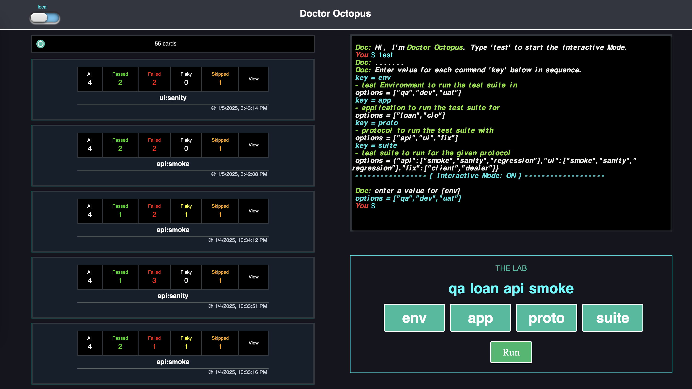

## DOCTOR-OCTOPUS

A multi-component application with full battery (a server & a client). The app includes The Lab: a test runner, Cards: a test report viewer and Terminal features that aim to make testing experience a smoother process for your website. The app is built for Playwright library that makes running Playwright test suites and then view the test report a simpler process. You can run a test suite using The Lab section and view the report it generates in the Cards section. When the 'View' button is clicked for a report, the app will start a local server to view the Playwright's default HTML report with my favorite Trace options.




## Setup

1 - `npm run setup`
2 - THE END

project folder structure

```
doctor-octopus
├─ server
│ ├─ src
│ │ └─ ... 
│ ├─ setup.py
│ └─ ... 
├─ client
│ ├─ src 
│ │ └─ ... 
│ ├─ package.json 
│ └─ ... 
├─ package.json
└─ README.md
```


## Key Tech Stacks

- **FastAPI**: server/back-end using Python
- **React**: client/front-end using JavaScript
- **SocketIO**: communicates between the client and the server to execute test suites on the server and stream the logs in the integrated xterm terminal
- **AWS S3**: remote repository for the test reports

Developer: **IMRAN SAHIL**